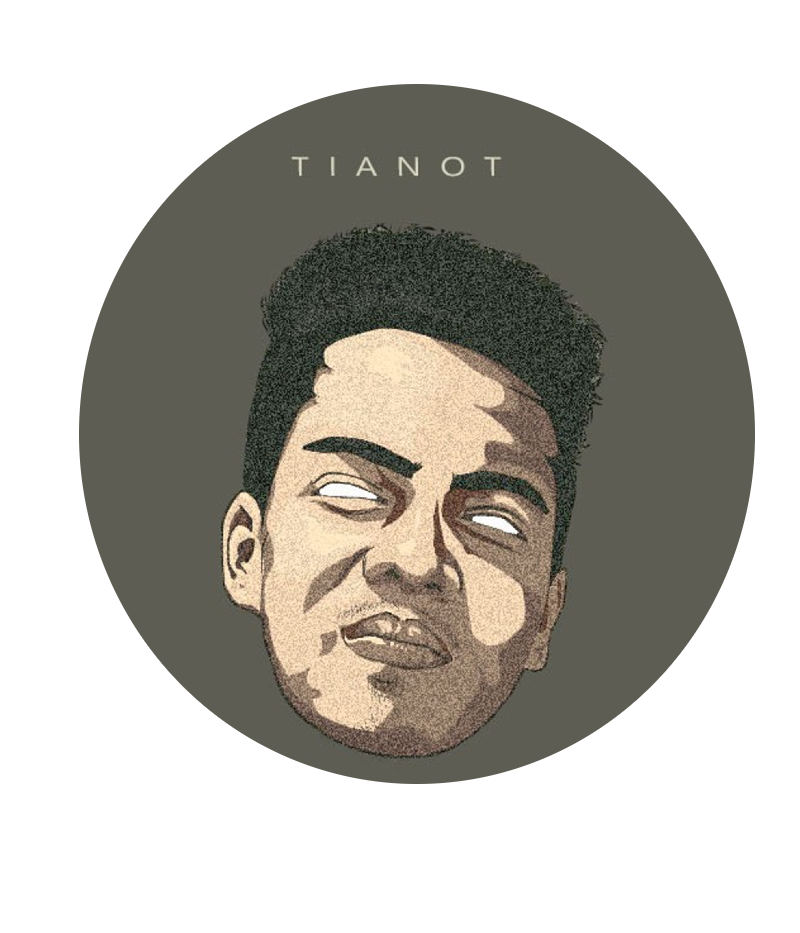
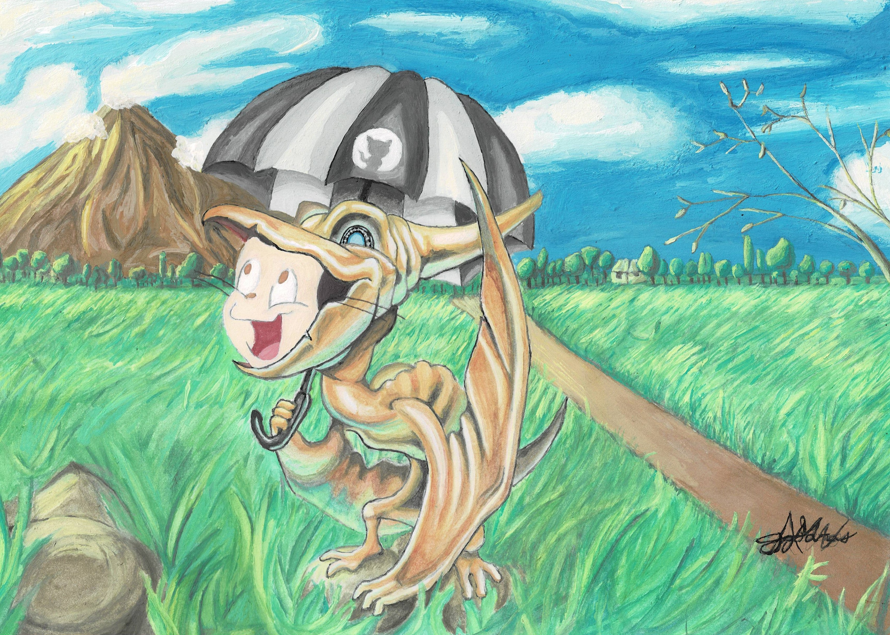

<h1 align="center">HI THERE! IT'S NICE TO MEET YOU👋</h1>

  
  
  

 

## I'm a BSIS Student!!

- 🌱 I’m currently learning everything 🤣
- 👯 I’m looking to collaborate with other content creators
- 🥅 Goals: Contribute more to Open Source projects
- ⚡ Fun fact: I'm an Octocat winner in 2021
### Languages and Tools:

 
 

<h2 align="center">    <strong>My Octocat Winning Piece in 2021</strong></h2>

 
 
<table align="center" width="100%">
  <tr>
    <td align="center">
       
      <table>
        <tr>
          <td align="center">
            
          </td>
          <td align="center">
            
          </td>
        </tr>
      </table>
    </td>
    <td align="center">
      
    </td>
  </tr>
  <tr>
          <td align="center">
            
          </td>
    <td align="center">
      
    </td>
  </tr>
</table>

 
